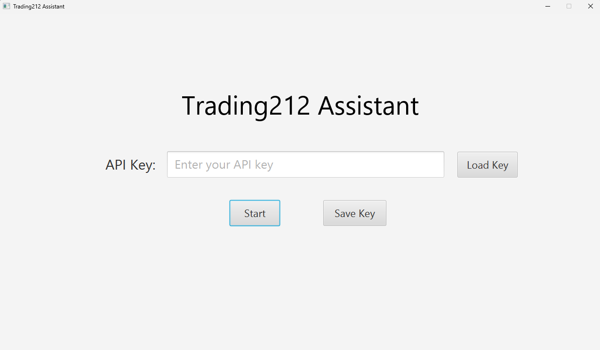
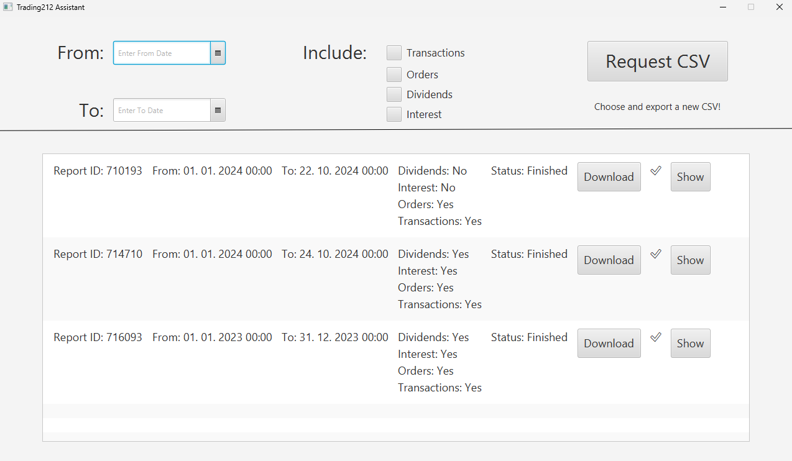
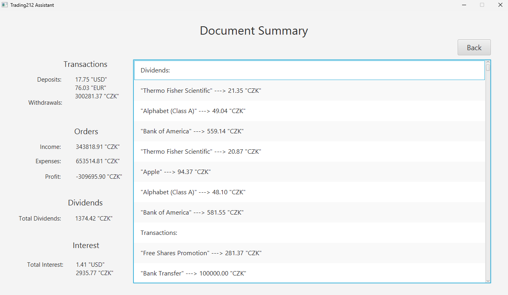

# Trading212 Assistant - User Guide

The Trading212 Assistant is designed to simplify managing and analyzing your trading reports. The application has a straightforward interface consisting of three main screens: the Landing Page, the CSV List Page, and the CSV Details Page.

## 1. Landing Page

### Purpose:
The Landing Page is the starting point where you authenticate your session with an API key.

### Key Elements:
- **API Key Field**: Enter your API key here to access the application’s functionality.
- **Buttons**:
  - **Start**: Initiates the session and takes you to the main CSV List Page if the API key is valid.
  - **Save Key**: Saves your API key for future sessions.
  - **Load Key**: Loads a previously saved API key.

### How to Use:
1. Enter your Trading212 API key.
2. Click **Start** to proceed.
3. Optionally, you can save the API key for quick access in future sessions by clicking **Save Key**. Use **Load Key** to retrieve the saved key.

---

## 2. CSV List Page

### Purpose:
The CSV List Page is divided into two parts - CSV request section and then the report list. In the section above the black line you may choose the interval from which you want to request a CSV file and you can also specify what to include (transactions, orders, dividends, interest).

### Key Elements:
- **Date Filters**: 
  - **From**: Sets the start date for the report.
  - **To**: Sets the end date for the report.
- **Include Options**: Checkboxes for including specific transaction types in the report:
  - **Transactions**: Basic account transactions.
  - **Orders**: Trading orders.
  - **Dividends**: Dividend payments.
  - **Interest**: Interest earned.
- **Request CSV Button**: Initiates the report generation based on the selected options and date range.
- **Report List**:
  - **Report ID**: A unique identifier for each report.
  - **Date Range**: Shows the start and end dates of the report.
  - **Status**: Displays the status of the report (e.g., Finished).
  - **Options**: 
    - **Download**: Download the report as a CSV file.
    - **Show**: View the detailed report in the CSV Details Page.

### How to Use:
1. Set the date range using the **From** and **To** fields.
2. Choose the types of transactions to include by checking the respective boxes.
3. Click **Request CSV** to generate a new report. It will appear at the bottom of the list.
4. Once the report is ready, you can **Download** it or click **Show** to view its details.

---

## 3. CSV Details Page

### Purpose:
The CSV Details Page provides a detailed summary of the selected report, including transactions, orders, dividends, and interest.

### Key Elements:
- **Transactions Section**: Shows all deposits and withdrawals, with the currency and amount displayed.
- **Orders Section**:
  - **Income**: Total income from trades in the selected period.
  - **Expenses**: Total expenses from trades in the selected period.
  - **Profit**: Net profit or loss based on income and expenses.
- **Dividends Section**:
  - **Total Dividends**: The total dividend amount received in the specified period.
- **Interest Section**: Displays the total interest earned.
- **Back Button**: Returns you to the CSV List Page.

### How to Use:
- Review detailed financial information such as income, expenses, dividends, and interest for the selected report in a more convenient form than a CSV file.
- Use the **Back** button to return to the CSV List Page to select another report if needed.